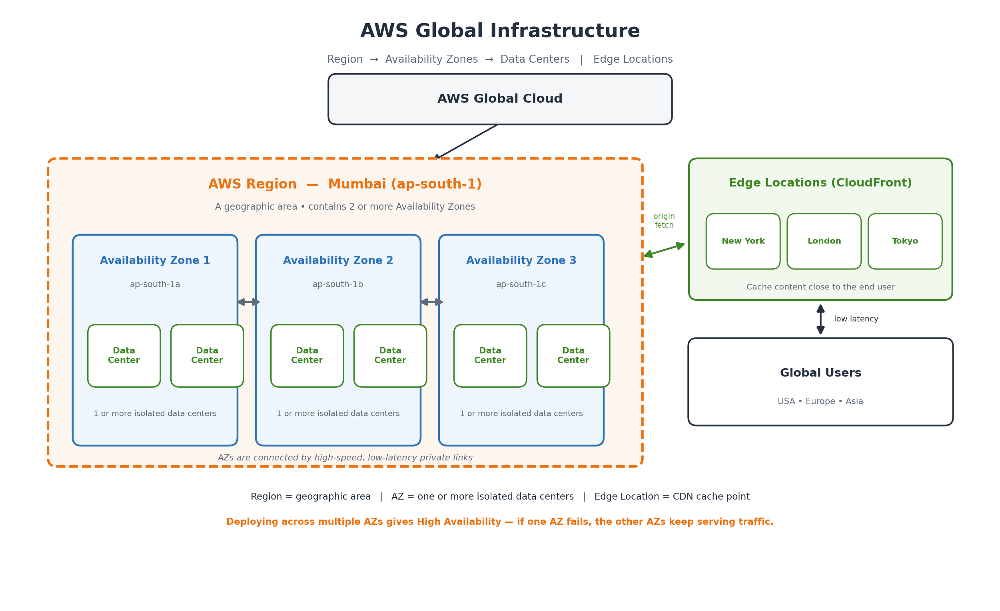

# AWS Learning — Assignment No. 1

**Topic:** Cloud Computing Fundamentals & AWS Global Infrastructure
**Name:** Sanket Kolhe  **Subject:** Cloud Computing (AWS)  **Date:** 01/09/2026

> Word file for submission: [AWS-Assignment-1.docx](AWS-Assignment-1.docx)

---

## Q1. What is Cloud Computing? Explain it in your own words and give two real-life examples of cloud usage.

**Answer:**

Cloud computing means using computing resources — servers, storage, databases, networking and software — over the internet from a cloud provider such as AWS, instead of buying, installing and maintaining that hardware ourselves. The provider owns the data centers; we simply rent whatever we need, whenever we need it, and pay only for what we actually use.

In simple words, it works like an electricity connection. We do not build a power plant at home — we just switch on the light and pay the bill for the units consumed. In the same way, we do not buy a physical server; we launch one on AWS in a few minutes, use it, and shut it down when the work is over.

**Key characteristics:** on-demand self-service, pay-as-you-go pricing, elasticity (scale up or down at any time), broad network access from any device, and no responsibility for the physical hardware.

**Two real-life examples:**

- **Google Drive / Google Photos** — our files, photos and documents are not stored on our own laptop but on Google's servers. We can open the same file from a phone, laptop or a cyber-cafe computer, and we never worry about disk failure or backups.
- **Netflix / Hotstar** — the movies and web series are stored and streamed from cloud servers (Netflix runs on AWS). Millions of people watch at the same time in the evening, and the platform automatically arranges extra servers to handle that rush.

*Other everyday examples are Gmail, WhatsApp chat backup on Google Drive/iCloud, and online exam or classroom portals.*

---

## Q2. A company has its own physical servers which are expensive to maintain and wants to move to AWS. What advantages can they expect?

**Answer:**

- **No large upfront investment (CapEx → OpEx)** — there is no need to purchase servers, racks, UPS or cooling equipment. The heavy one-time capital expense becomes a small monthly operational expense.
- **Pay-as-you-go pricing** — the company is billed only for the resources actually used (per second/hour for EC2, per GB for S3). Idle hardware no longer wastes money.
- **Elasticity and scalability** — capacity can be increased during peak load and reduced afterwards using Auto Scaling. Buying a physical machine takes weeks; on AWS it takes minutes.
- **No hardware maintenance headache** — AWS takes care of power, cooling, physical security and hardware replacement. The IT team can focus on the application instead of the data center.
- **High availability and fault tolerance** — the application can be deployed across multiple Availability Zones, so a single hardware or site failure does not bring the business down.
- **Reliable backup and disaster recovery** — automated snapshots, S3 versioning and cross-region copies give a low-cost DR setup that would be very expensive with a second physical site.
- **Speed and agility** — new test environments or products can be created in minutes, so features reach the market faster.
- **Global reach** — the application can be deployed in AWS Regions near the customers and cached at Edge Locations, reducing latency worldwide.
- **Strong security and compliance** — IAM for fine-grained access control, encryption at rest and in transit, KMS, security groups and CloudTrail auditing, under the Shared Responsibility Model.
- **Managed services reduce workload** — Amazon RDS, S3, AWS Lambda and CloudWatch remove routine tasks such as patching, replication and monitoring setup.

---

## Q3. Differentiate between IaaS, PaaS, and SaaS with one AWS example for each.

**Answer:**

| Point | IaaS (Infrastructure as a Service) | PaaS (Platform as a Service) | SaaS (Software as a Service) |
|---|---|---|---|
| **Meaning** | Provider gives raw IT infrastructure — virtual servers, storage and network — which we configure ourselves. | Provider gives a ready platform to build, deploy and run applications; we only supply the code. | Provider gives complete ready-to-use software over the internet; we just log in and use it. |
| **Managed by user** | OS, runtime, middleware, application, data and patching inside the instance. | Only the application code and its data. | Nothing technical — only our own data and user settings. |
| **Managed by AWS** | Physical servers, storage, network, virtualisation. | Everything up to the runtime — OS, servers, scaling, load balancing. | The entire stack including the application itself. |
| **Control vs ease** | Maximum control, maximum responsibility. | Balanced — less control, much less maintenance. | Least control, easiest to use. |
| **AWS example** | **Amazon EC2** (also EBS, VPC) | **AWS Elastic Beanstalk** (also Lambda, RDS) | **Amazon WorkMail / WorkDocs / Chime** |
| **Typical user** | System administrators, infrastructure engineers. | Application developers. | End users of the business. |

**In one line:** IaaS gives us the land and bricks (EC2), PaaS gives us a ready building where we only arrange the furniture (Elastic Beanstalk), and SaaS gives us a fully furnished flat that we simply move into (Amazon WorkMail, or Gmail outside AWS).

---

## Q4. A company wants critical applications on its own servers but cloud resources when required. Which deployment model is suitable and why?

**Answer: Hybrid Cloud.**

A hybrid cloud connects the company's existing private/on-premises data center with a public cloud such as AWS, so that both work together as one environment. The critical applications and sensitive data stay on the company's own servers, while AWS is used for extra capacity whenever demand increases — a pattern known as **cloud bursting**.

**Why it is the best choice here:**

- **Control over critical workloads** — the most important applications and confidential data stay inside the company's own data center.
- **Meets compliance and data-residency rules** — regulated data (financial, medical, government) that must not leave the premises can legally stay on-premises.
- **Cloud bursting for peak demand** — during a sale, month-end processing or a traffic spike, extra servers are launched on AWS and released afterwards.
- **Cost efficiency** — the existing hardware investment keeps giving value, and AWS is paid only for temporary extra usage.
- **Better disaster recovery** — AWS acts as the backup/DR site at a fraction of the cost of a second physical data center.
- **Smooth, gradual migration** — applications move to the cloud one by one instead of a risky big-bang migration.

**AWS services that enable it:** AWS Direct Connect / Site-to-Site VPN, AWS Outposts, VMware Cloud on AWS, AWS Storage Gateway, AWS DataSync.

**Why not the others:** a fully public cloud would mean moving critical applications out of the company's own data center, and a fully private cloud would again require buying hardware for the peak load — exactly the cost problem they want to avoid.

---

## Q5. Why would an app like Blinkit/Swiggy/Amazon, with thousands of simultaneous orders, need cloud infrastructure?

**Answer:**

Such applications face traffic that is huge, sudden and unpredictable — a rush at lunch and dinner time, during an IPL match, on a rainy evening, or during a festival sale. Only cloud infrastructure can handle this pattern economically.

- **Elasticity / Auto Scaling** — AWS Auto Scaling adds EC2 instances automatically when traffic rises and removes them when it falls.
- **Load balancing** — an Elastic Load Balancer spreads requests across many servers in different AZs, so no single server crashes under load.
- **High availability** — a few minutes of downtime at peak means lost orders and revenue, so the app must run in multiple AZs with automatic failover.
- **Handling peaks without wasting money** — buying servers for the busiest two hours of the year would leave them idle the rest of the time.
- **Databases that can scale** — Amazon RDS with read replicas or DynamoDB handle millions of reads/writes for orders, carts and inventory.
- **Large media storage and fast delivery** — lakhs of product/restaurant images in Amazon S3, delivered through CloudFront Edge Locations.
- **Real-time features** — live order tracking, delivery-partner location updates and push notifications need low-latency backend services.
- **Data analytics and personalisation** — recommendations, demand prediction, dark-store stock planning and surge pricing need big-data processing on demand.
- **Multi-city / global reach** — servers close to users in each region give faster app response.
- **Security of payments** — encryption, IAM, AWS WAF and AWS Shield protect payment and personal data even during heavy traffic.

---

## Q6. Difference between an AWS Region and an Availability Zone (AZ). Why multiple AZs within a Region?

**Answer:**

| Point | AWS Region | Availability Zone (AZ) |
|---|---|---|
| **Definition** | A separate geographic area where AWS has a cluster of data centers. | One or more discrete data centers inside a Region, each with independent power, cooling and networking. |
| **Example** | Mumbai (ap-south-1), N. Virginia (us-east-1), Frankfurt (eu-central-1) | ap-south-1a, ap-south-1b, ap-south-1c |
| **Size / scope** | Contains a minimum of two — usually three or more — AZs. | Contains one or more physical data centers. |
| **Distance** | Regions are hundreds/thousands of km apart. | AZs are a few km apart — far enough to avoid a common disaster, close enough for low-latency links. |
| **Purpose** | Chosen for latency, data-residency laws, service availability and price. | Used to build high availability and fault tolerance inside the Region. |
| **Connectivity** | Connected over the AWS global backbone network. | Connected by high-bandwidth, low-latency, redundant private fibre links. |

**Why AWS keeps multiple AZs in one Region:**

- **Fault isolation** — each AZ has its own power, cooling and network, so a failure in one AZ does not affect the others.
- **High availability** — an application spread over two or three AZs keeps running even if one complete AZ goes down.
- **Disaster resilience** — AZs are physically separated, so a local disaster cannot destroy all of them together.
- **Synchronous replication with low latency** — fast private links allow Amazon RDS Multi-AZ to keep a real-time standby database.
- **Scalability and capacity** — more AZs mean more physical capacity within the same Region.
- **Meeting SLAs** — the AWS availability SLA for services like EC2 assumes deployment across multiple AZs.

---

## Q7. A company hosts its website in Mumbai but customers are in the USA and Europe. How do AWS Edge Locations help?

**Answer:**

If the servers are only in the Mumbai Region, every request from the USA or Europe travels thousands of kilometres and back, adding high latency. AWS Edge Locations — used by Amazon CloudFront (CDN), Amazon Route 53 and AWS Global Accelerator — solve exactly this problem.

- **Content is cached near the user** — images, CSS, JavaScript and video are copied to Edge Locations in New York, London, Frankfurt, etc., and served from the nearest edge instead of Mumbai.
- **Much lower latency** — the round trip becomes a few milliseconds instead of hundreds, so the site feels fast.
- **Faster dynamic content too** — requests that must reach the Mumbai origin travel over the optimised AWS backbone instead of the public internet.
- **Reduced load on the origin server** — most repeated requests are answered by the cache, so Mumbai servers handle far less traffic.
- **Lower data-transfer cost** — serving from cache is cheaper than serving every byte from the origin Region.
- **Better availability** — if the origin is briefly unreachable, cached content can still be served.
- **Security at the edge** — AWS Shield (DDoS), AWS WAF and TLS termination happen at the edge, stopping attacks far from the origin.
- **Smart routing** — Route 53 latency-based or geolocation routing sends each user to the fastest endpoint.

**Result:** customers in the USA and Europe get almost the same fast experience as customers in India, without building any servers outside Mumbai.

---

## Q8. An application runs in only one AZ and that AZ becomes unavailable. What problems occur, and how should it be designed?

**Answer:**

**Problems that could occur:**

- **Complete outage** — a single AZ is a single point of failure, so this is 100% downtime, not just a slowdown.
- **Possible data loss** — if the database and its EBS volumes/snapshots exist only in that AZ, recent data may be lost or locked until it recovers.
- **Business and revenue loss** — orders, payments and transactions stop.
- **Loss of customer trust and reputation** — users move to a competitor and the brand is damaged publicly.
- **SLA breach and penalties** — the company may fail the uptime promised to its own customers.
- **Long, manual recovery** — without a standby setup the team must rebuild servers and restore backups by hand.

**How to design for better availability:**

- **Deploy across multiple Availability Zones** — run EC2 instances in at least two or three AZs.
- **Use an Elastic Load Balancer** — an ALB/NLB spanning several AZs health-checks targets and routes only to healthy ones.
- **Use an Auto Scaling group across AZs** — it relaunches capacity in a healthy AZ if one AZ fails.
- **Enable Amazon RDS Multi-AZ (or Aurora)** — a synchronous standby in another AZ takes over automatically.
- **Store objects in Amazon S3** — S3 already replicates across multiple AZs automatically.
- **Make the application stateless** — keep sessions in ElastiCache or DynamoDB so any instance can serve any user.
- **Add Route 53 health checks and DNS failover** — traffic is redirected away from unhealthy endpoints.
- **Plan multi-Region disaster recovery** — backups, AMIs and cross-region replication for very critical systems.
- **Use Infrastructure as Code and test failover** — CloudFormation/Terraform plus periodic drills prove the design works.

---

## Q9. Pick an app you use regularly and identify (a) why it needs cloud computing, (b) what data it stores, (c) why high availability matters.

**Answer — Application chosen: Instagram**

### a) Why Instagram needs cloud computing

- **Massive global scale** — over two billion users upload and view content daily; no fixed-size owned data center could serve this.
- **Unpredictable traffic spikes** — a celebrity post, a festival, New Year's Eve or a cricket final creates sudden bursts needing instant capacity.
- **Huge storage requirement** — photos, videos, Reels and Stories add petabytes continuously; cloud storage grows without hardware planning.
- **Fast global delivery** — a CDN with edge caching makes a Reel load instantly in India, the USA and Europe alike.
- **Heavy computing for AI/ML** — feed ranking, Explore, Reels recommendations, face/object detection and content moderation need large-scale GPU/compute on demand.
- **Cost efficiency and development speed** — pay-as-you-go resources and managed services let features ship quickly.

### b) What type of data it may store

- **User account data** — name, username, email, phone, DOB, bio, profile photo, hashed passwords.
- **Media content** — photos, videos, Reels, Stories, highlights and thumbnails in multiple resolutions.
- **Social graph data** — followers, following, close-friends lists, blocked accounts.
- **Engagement data** — likes, comments, shares, saves, views, watch time.
- **Messages** — direct messages, media shared in chats, message metadata.
- **Metadata** — timestamps, captions, hashtags, tagged users, device details, optional geotags.
- **Behavioural and analytics data** — search history, scrolling behaviour, session logs, interests used for recommendations.
- **Advertising and business data** — ad campaigns, impressions, clicks, creator/business insights, ad payment details.

### c) Why high availability is important for it

- **24 × 7 global usage** — users are active in every time zone, so there is no safe downtime window.
- **Direct revenue impact** — advertising is the main income; every minute of downtime means lost impressions.
- **Livelihood of creators and businesses** — influencers and small shops depend on it for reach and sales.
- **Real-time features** — DMs, Live video and Stories must work instantly.
- **Reputation and user trust** — an outage immediately trends elsewhere and pushes users to competitors.
- **Data safety** — users' memories are stored there, so data must be replicated across AZs and Regions.

---

## Q10. Diagram of AWS Global Infrastructure: Region → Availability Zones → Data Centers → Edge Locations

**Answer:**



*Figure 1: AWS Global Infrastructure — Region → Availability Zones → Data Centers, with Edge Locations serving users globally.*

**Text form of the hierarchy:**

```
AWS Global Cloud
  |
  +-- Region  (e.g. Mumbai / ap-south-1)
  |      +-- Availability Zone 1 (ap-south-1a)  -->  Data Center 1, Data Center 2
  |      +-- Availability Zone 2 (ap-south-1b)  -->  Data Center 1, Data Center 2
  |      +-- Availability Zone 3 (ap-south-1c)  -->  Data Center 1, Data Center 2
  |
  +-- Edge Locations  (New York, London, Tokyo, Mumbai, ...)  -->  End Users
```

**How these components work together:**

1. A **Region** is a large geographic area where AWS has built its infrastructure, and every Region contains at least two — usually three or more — Availability Zones.
2. Each **Availability Zone** is made up of one or more physically separate **Data Centers** with their own power, cooling and networking, and the AZs are joined by high-speed, low-latency private links.
3. When an application is deployed in two or three AZs of the same Region, the failure of one AZ (or of one data center inside it) does not stop the application — this is how **high availability and fault tolerance** are achieved.
4. **Edge Locations** are a much larger, separate network of small sites spread across many cities. Through Amazon CloudFront they cache content coming from the Region and deliver it from the point nearest to the user, reducing latency and taking load off the origin servers.
5. Together they give the best of both: the Region and its AZs provide reliable compute and storage, while the Edge Locations provide fast global delivery to end users.

---

## Conclusion

This assignment covered the meaning and benefits of cloud computing, the three service models (IaaS, PaaS and SaaS), the hybrid deployment model, and the building blocks of the AWS Global Infrastructure — Regions, Availability Zones, Data Centers and Edge Locations. The main takeaway is that the cloud removes the cost and the limits of owning hardware, and that designing across multiple Availability Zones, with Edge Locations for global reach, is what makes an application scalable, fast and highly available.
