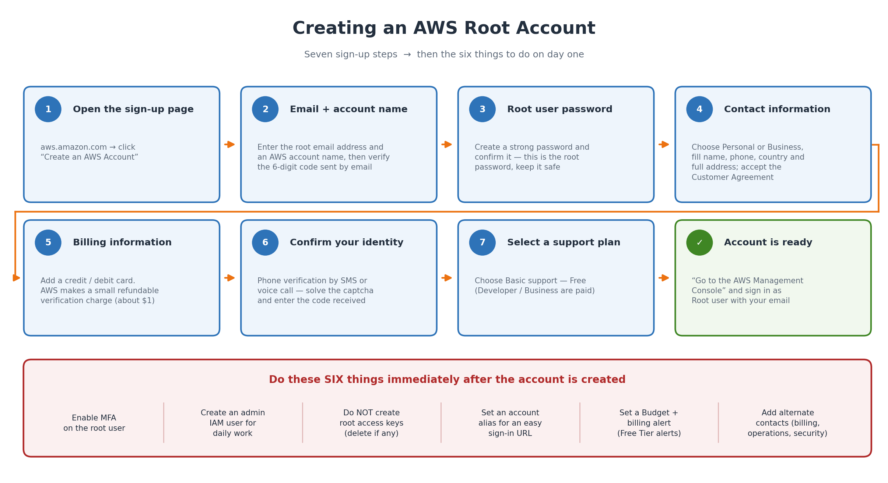

# AWS Learning — Assignment No. 2

**Topic:** AWS Root Account Creation — Step by Step
**Name:** Sanket Kolhe  **Subject:** Cloud Computing (AWS)  **Date:** 05/09/2026

> Submission files: [AWS-Assignment-2.pdf](AWS-Assignment-2.pdf) · [AWS-Assignment-2.docx](AWS-Assignment-2.docx)

**Q.1 Enlist the steps involved in the process of AWS Root Account creation.**

---

## What is the AWS Root Account?

The root account is the very first account created when we sign up for AWS. The email address used at sign-up becomes the **root user**, and this identity has **unrestricted access** to every service, every resource and all billing information in the account. Because it has full power, AWS recommends using it only for a few special tasks and protecting it with MFA.

### What you need before starting

- **A valid email address** — must not already be linked to another AWS account
- **A mobile number** — for the identity verification call/SMS
- **A credit or debit card** — international transactions enabled; AWS takes a small refundable charge (~$1 / ₹2)
- **Full address details** — country, address, city, state, postal code
- **A strong password** for root, and an authenticator app on the phone for MFA



---

## Steps to create the AWS root account

### Step 1 — Open the AWS sign-up page
1. Go to **https://aws.amazon.com**
2. Click **Create an AWS Account** (top right)

```
Direct link:  https://portal.aws.amazon.com/billing/signup
```

### Step 2 — Enter the email address and account name
1. Type the **Root user email address** — this email becomes the root user
2. Type an **AWS account name**, e.g. "Sanket-Learning-Account" (changeable later)
3. Click **Verify email address**
4. AWS emails a **6-digit code** — paste it and click **Verify**

*If the mail does not arrive, check spam and use "Resend code".*

### Step 3 — Create the root user password
1. Enter the **Root user password** and confirm it
2. Click **Continue**

*Minimum 8 characters with uppercase, lowercase, a number and a symbol. Store it safely.*

### Step 4 — Fill the contact information
1. Choose **Personal** or **Business** (features are the same)
2. Fill full name, phone number, country/region, address, city, state, postal code
3. Tick the **AWS Customer Agreement** → **Continue**

*The address should match the billing address of the card, otherwise verification can fail.*

### Step 5 — Add the billing information
1. Enter the **card number, expiry date and cardholder name**
2. Choose the billing address
3. Click **Verify and Continue**

> ⚠️ AWS charges a small refundable amount (~$1 / ₹2) only to confirm the card is valid. It is reversed in a few days. The card must allow international online transactions.

### Step 6 — Confirm your identity
1. Choose **Text message (SMS)** or **Voice call**
2. Select country code, enter the **mobile number**, solve the **captcha**
3. Click **Send SMS**
4. Enter the **4-digit code** → **Continue**

### Step 7 — Select a support plan

| Plan | Cost | Choose when |
|---|---|---|
| **Basic support** | **Free** | Learning / personal — **select this** |
| Developer support | from ~$29/month | Testing and development |
| Business support | from ~$100/month | Production, 24×7 help |

Click **Complete sign up**. *The plan can be changed later from the Support Center.*

### Step 8 — Sign in for the first time
1. On the "Congratulations" page click **Go to the AWS Management Console**
2. Choose **Root user** → enter the email → **Next** → enter the password
3. The console opens — the account is ready

> **Note:** Activation is usually done in minutes but can take up to **24 hours**. Until then some services show "account is being activated". A confirmation email arrives once it finishes.

---

## What to do immediately after creating the account

### 1. Enable MFA on the root user
1. Sign in as **root** → open the **IAM console**
2. **Security recommendations → Add MFA** (or account menu → Security credentials)
3. **Multi-factor authentication (MFA)** → **Assign MFA device**
4. Name the device and choose the type:
   - **Authenticator app** — Google/Microsoft Authenticator, Authy (free, most common)
   - **Security key** — e.g. YubiKey
   - **Hardware TOTP token** — a key-fob device
5. Scan the QR code, enter **two consecutive codes**, click **Add MFA**

### 2. Create an administrator IAM user for daily work
1. **IAM → Users → Create user**
2. Give a name, tick console access, set a password
3. Create/select an **Administrators** group with the **AdministratorAccess** policy
4. Create the user, enable MFA for it too, and use **this** user for normal work

*Full steps: [Assignment 3](../Assignment-3/Assignment-3.md).*

### 3. Do not create root access keys
Root access keys are extremely dangerous — if leaked, the whole account is gone. Never create them. If any exist: **Account menu → Security credentials → Access keys → Delete**.

### 4. Set an account alias
**IAM → Dashboard → AWS Account → Account Alias → Create** → e.g. `sanket-aws`

```
Before:  https://123456789012.signin.aws.amazon.com/console
After :  https://sanket-aws.signin.aws.amazon.com/console
```

### 5. Set a budget and billing alerts
1. Open **Billing and Cost Management**
2. **Billing preferences** → turn on **Receive Free Tier alerts** and **Receive billing alerts**
3. **Budgets → Create budget** → **Cost budget** → set e.g. **$5** → add your email

*This prevents a surprise bill — the most common problem for new AWS learners.*

### 6. Add alternate contacts
**Account menu → Account → Alternate contacts** → add **Billing**, **Operations** and **Security** contacts.

---

## Important points

### Tasks only the root user can perform
- Change the AWS account name, root email or root password
- Change the support plan
- **Close the AWS account**
- Move the account into/out of AWS Organizations
- Restore IAM permissions when an admin has locked everyone out
- Fix an invalid S3 bucket policy or SQS policy that denies everyone
- Sign up for AWS GovCloud; register as a seller in the Reserved Instance Marketplace

### AWS Free Tier — three types

| Type | Meaning | Example |
|---|---|---|
| **12 months free** | Free for one year from sign-up | 750 hrs/month t2.micro or t3.micro EC2; 5 GB S3 |
| **Always free** | No time limit | 1 million Lambda requests/month; 25 GB DynamoDB |
| **Trials** | Free for a short period after first use | Amazon SageMaker and some others |

> 🔴 Free Tier is **not unlimited**. Crossing the limit, or leaving an EC2 instance or Elastic IP running, starts real charges. Always set a budget alert and stop/terminate resources after practising.

### Root account vs IAM user

| Point | Root user | IAM user |
|---|---|---|
| Created | Automatically at sign-up | Manually inside IAM |
| Sign in with | Email + password | Account ID/alias + user name + password |
| Permissions | Unrestricted — **cannot** be limited by an IAM policy | Only what its policies allow |
| Number | Exactly **one** per account | Up to 5,000 |
| Daily use | ❌ Not recommended | ✅ Recommended |

### Common problems during sign-up

| Problem | Reason | Solution |
|---|---|---|
| "This email is already in use" | An AWS account already exists with it | Use another email, or recover the existing account |
| Card declined | International transactions off, or address mismatch | Enable international use, check billing address, try another card |
| Verification code not received | Wrong number / network / spam | Use voice call, check spam, click Resend |
| "Account is being activated" for long | AWS still verifying the payment method | Wait (up to 24 h), then contact AWS Support |
| Unexpected bill after practice | A resource left running beyond Free Tier | Stop/terminate EC2, release Elastic IPs, delete volumes, set a budget |

### Viva questions

| Q | Answer |
|---|---|
| What is the root account? | The first identity created at sign-up, identified by the sign-up email, with unrestricted access to everything |
| Why a card if we only use Free Tier? | To verify identity and charge anything beyond Free Tier; only a small refundable amount is taken |
| Which support plan for a student? | **Basic** — it is free |
| First thing after creating the account? | Enable **MFA on root** and create an **admin IAM user** |
| Can root permissions be restricted by an IAM policy? | **No** — only an Organizations **SCP** can restrict root |
| Why never create root access keys? | If leaked, the attacker gets full control and it cannot be limited |
| What is an account alias for? | Replaces the 12-digit ID in the sign-in URL, easier to remember |

---

## Conclusion

Creating an AWS root account is a seven-step online process: open the sign-up page, verify the email, set the root password, fill contact details, add a payment method, verify the phone number and choose a support plan. The account is ready within minutes.

The more important part is what follows — **enabling MFA on root, creating an administrator IAM user, avoiding root access keys and setting a billing budget**. The root account should then be kept aside and used only for the few tasks nothing else can perform.
