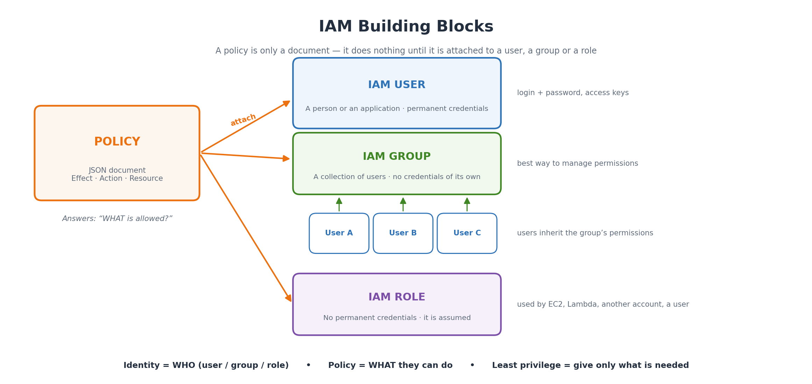
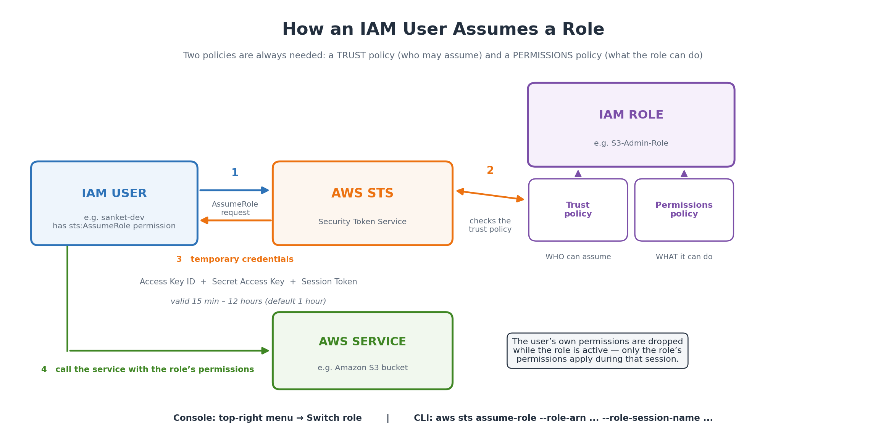

# AWS Learning — Assignment No. 3

**Topic:** Identity and Access Management (IAM) — Practical Steps
**Name:** Sanket Kolhe  **Subject:** Cloud Computing (AWS)  **Date:** 05/09/2026

> Word file for submission: [AWS-Assignment-3.docx](AWS-Assignment-3.docx)

**Q. Enlist the detailed steps involved in —**
a) Creation of IAM User and different ways of adding policies to it
b) Creation of IAM Group and managing permission by adding user to the group
c) Creation of IAM Role
d) Assuming an IAM Role by an IAM User

---

## Before we start — IAM in short

IAM controls **"who can do what"** inside an AWS account.

| Term | Meaning | Key point |
|---|---|---|
| **IAM User** | Permanent identity for one person or app | Has permanent credentials (password / access keys) |
| **IAM Group** | A collection of users | Only a container — no credentials, cannot log in |
| **IAM Role** | Identity that is temporarily assumed | No permanent credentials; STS gives temporary keys |
| **Policy** | JSON document listing permissions | Does nothing until attached to a user/group/role |
| **Principal** | The entity making the request | Written in a policy as an ARN |
| **ARN** | Amazon Resource Name | `arn:aws:iam::123456789012:user/sanket-dev` |
| **AWS STS** | Security Token Service | Issues the temporary credentials |



**Prerequisites:** sign in as root or an admin IAM user → open the IAM console → remember **IAM is global** (no Region selector).

> **Note:** For real human logins AWS now recommends **IAM Identity Center**. IAM users are still used for learning, small accounts and applications.

---

## a) Creation of an IAM User

### A.1 Steps (console)

1. **Sign in** to the AWS Console as root or an admin IAM user.
2. **Open the IAM console** — search "IAM" in the top search bar.
3. Left pane → **Access management → Users** → click **Create user**.
4. **Specify user details** — type the **User name**, e.g. `sanket-dev` (must be unique in the account).
5. **Console access** — tick *"Provide user access to the AWS Management Console"* only if the user will log in through a browser. Then choose:
   - **Console password** — Autogenerated or Custom
   - Keep *"Users must create a new password at next sign-in"* ticked
   - *If the user is only for CLI/app, leave this unticked — use access keys instead.*
6. **Next → Set permissions** — choose one of three options (details in A.3):
   - **Add user to group** (recommended)
   - **Copy permissions** from an existing user
   - **Attach policies directly**
7. *(Optional)* Expand **Set permissions boundary** to cap the maximum permissions.
8. **Next → Review and create** — check everything, add **Tags** if needed.
9. Click **Create user**.
10. **Retrieve the password** — click **Download .csv file** or **Show**, and note the sign-in URL:
    ```
    https://<12-digit-account-id>.signin.aws.amazon.com/console
    ```
    ⚠️ This is the **only time** the auto-generated password is shown.
11. **Verify** — open an incognito window, go to the sign-in URL and log in as the new user.

### A.2 Creating access keys (CLI / SDK)

Access keys are **not** created automatically any more.

1. **IAM → Users → <user>** → **Security credentials** tab.
2. Scroll to **Access keys** → **Create access key**.
3. Choose use case → **Command Line Interface (CLI)** → tick the confirmation → Next.
4. Add a description tag → **Create access key**.
5. **Download .csv** — the Secret access key is shown **only once**.
6. Configure the CLI:
   ```bash
   aws configure
   aws sts get-caller-identity      # check which identity is in use
   ```

> 🔴 **Never** put access keys in code or on an EC2 instance. For anything running on AWS, attach a **role** instead.

### A.3 Six ways of adding policies to a user

**Way 1 — Attach an AWS managed policy directly**
1. **IAM → Users → <user> → Permissions** tab
2. **Add permissions → Add permissions**
3. Select **Attach policies directly**
4. Search e.g. `AmazonS3ReadOnlyAccess` → tick → **Next → Add permissions**

```bash
aws iam attach-user-policy --user-name sanket-dev \
    --policy-arn arn:aws:iam::aws:policy/AmazonS3ReadOnlyAccess
```

**Way 2 — Create and attach a customer managed policy** (when no AWS policy fits)
1. **IAM → Policies → Create policy**
2. Use the **Visual** editor or the **JSON** tab
3. **Next** → name it e.g. `S3-ReadOnly-MyBucket` → **Create policy**
4. Attach it: **Users → <user> → Add permissions → Attach policies directly** → filter **Customer managed**

```json
{
  "Version": "2012-10-17",
  "Statement": [
    { "Sid": "ListTheBucket", "Effect": "Allow",
      "Action": ["s3:ListBucket"],
      "Resource": "arn:aws:s3:::my-college-bucket" },
    { "Sid": "ReadTheObjects", "Effect": "Allow",
      "Action": ["s3:GetObject"],
      "Resource": "arn:aws:s3:::my-college-bucket/*" }
  ]
}
```
*Every policy skeleton:* Version → Statement → **Effect, Action, Resource** (+ optional Condition).

**Way 3 — Through a group (recommended)**
1. Create the group and attach policies to it (part b)
2. **Users → <user> → Groups** tab → **Add user to groups**

```bash
aws iam add-user-to-group --user-name sanket-dev --group-name Developers
```

**Way 4 — Copy permissions from an existing user**
While creating the user (or from Add permissions) choose **Copy permissions** → select the existing user. Group memberships, managed policies and inline policies are all copied.

**Way 5 — Inline policy** (one user only, deleted with the user)
1. **Users → <user> → Permissions** tab
2. **Add permissions → Create inline policy**
3. Visual or JSON editor → **Next** → name → **Create policy**

**Way 6 — Permissions boundary** (advanced — grants nothing, only caps)
**Users → <user> → Permissions** tab → **Permissions boundary → Set boundary**
*Boundary ∩ Policy = final permission.* If boundary allows only S3 and the policy allows S3 + EC2, the user gets **only S3**.

### Comparison

| Way | Reusable? | When to use | Deleted with user? |
|---|---|---|---|
| AWS managed policy | Yes (AWS maintains) | Standard permissions | No |
| Customer managed policy | Yes (you maintain) | Your exact requirement | No |
| Group membership | Yes | Teams — **best practice** | No |
| Copy permissions | One-time copy | New member of a team | No |
| Inline policy | No | One-off exception | **Yes** |
| Permissions boundary | Yes | Cap the maximum | No |

---

## b) Creation of an IAM Group + managing permissions

### B.1 Create the group

1. Open the **IAM console**
2. Left pane → **Access management → User groups** → **Create group**
3. Enter the **User group name**, e.g. `Developers` (name it after the job role)
4. *(Optional)* **Add users to the group** — tick the members
5. **Attach permissions policies** — e.g. `AmazonS3ReadOnlyAccess`, `AmazonEC2ReadOnlyAccess`
6. Click **Create user group**

```bash
aws iam create-group --group-name Developers
aws iam attach-group-policy --group-name Developers \
    --policy-arn arn:aws:iam::aws:policy/AmazonS3ReadOnlyAccess
```

### B.2 Add a user to the group — two ways

**From the group side:** IAM → **User groups → <group> → Users** tab → **Add users** → tick → **Add users**

**From the user side:** IAM → **Users → <user> → Groups** tab → **Add user to groups** → select

```bash
aws iam add-user-to-group --user-name sanket-dev --group-name Developers
aws iam get-group --group-name Developers          # list members
```

### B.3 Manage the group's permissions

1. **User groups → <group> → Permissions** tab
2. Add: **Add permissions → Attach policies**
3. Remove: click **Remove / Detach** next to the policy
4. Remove a user: **Users** tab → tick → **Remove**

*Any change applies immediately to every user in the group.*

### B.4 Verify

- Log in as the user → open S3 → buckets visible (read-only)
- Try to delete an object → must fail with access denied
- Or check **Users → <user> → Access Advisor**

> **Important:** A group is **not an identity** — it cannot be a Principal in a policy and has no credentials. Groups **cannot be nested**. One user can be in up to **10 groups** by default.

---

## c) Creation of an IAM Role

A role has permission policies but **no permanent credentials** — it is *assumed*, and AWS STS gives temporary credentials.

**Every role always has two policies:**

| Policy | Question it answers | Example |
|---|---|---|
| **Trust policy** | WHO can assume this role? | EC2 service, another account, an IAM user |
| **Permissions policy** | WHAT can it do after assuming? | AmazonS3FullAccess |

### C.1 Trusted entity types

| Trusted entity | Used for |
|---|---|
| **AWS service** | EC2, Lambda, ECS — most common |
| **AWS account** | Cross-account, or a user of this account |
| **Web identity** | Google / Facebook / OIDC login |
| **SAML 2.0 federation** | Company Active Directory login |
| **Custom trust policy** | You write the trust JSON yourself |

### C.2 Service role — EC2 needs to read S3

1. **IAM → Roles → Create role**
2. **Trusted entity type** → **AWS service**
3. **Use case** → **EC2** → **Next**
4. **Add permissions** → tick `AmazonS3ReadOnlyAccess` → **Next**
5. **Role name** → `EC2-S3-ReadOnly-Role` + description
6. Check the trust policy on the review page:
   ```json
   {
     "Version": "2012-10-17",
     "Statement": [{
       "Effect": "Allow",
       "Principal": { "Service": "ec2.amazonaws.com" },
       "Action": "sts:AssumeRole"
     }]
   }
   ```
7. **Create role**
8. Attach to an instance: **EC2 console → Instances → select → Actions → Security → Modify IAM role** → choose → **Update IAM role**
9. Verify on the instance:
   ```bash
   aws sts get-caller-identity      # shows the assumed-role ARN
   aws s3 ls                        # works with NO access keys
   ```

> **Why this matters:** no keys stored on disk, and AWS rotates the credentials automatically. This is the main reason roles exist.

### C.3 Cross-account role

1. In the **trusting account** → **Roles → Create role**
2. **AWS account → Another AWS account** → enter the 12-digit **Account ID**
3. *(Recommended)* tick **Require external ID** (third parties) and **Require MFA**
4. Attach the permissions policy → name → create
5. In the **trusted account**, give the user `sts:AssumeRole` on that role ARN

---

## d) Assuming an IAM Role by an IAM User

The user temporarily gives up its own permissions and works with the role's permissions instead.



**Two permissions are always needed — this is what students miss:**

| Side | What is needed | Where |
|---|---|---|
| **On the role** | Trust policy naming the user as principal | Role → **Trust relationships** tab |
| **On the user** | Identity policy allowing `sts:AssumeRole` on the role ARN | User → **Permissions** tab |

### D.1 Create the role to be assumed

1. **IAM → Roles → Create role**
2. Choose **Custom trust policy** (or AWS account → This account) and paste:
   ```json
   {
     "Version": "2012-10-17",
     "Statement": [{
       "Effect": "Allow",
       "Principal": { "AWS": "arn:aws:iam::123456789012:user/sanket-dev" },
       "Action": "sts:AssumeRole"
     }]
   }
   ```
3. **Next** → attach the permissions policy, e.g. `AmazonS3FullAccess`
4. Name it `S3-Admin-Role` → **Create role**
5. Copy the **Role ARN**: `arn:aws:iam::123456789012:role/S3-Admin-Role`

### D.2 Allow the user to assume the role

**IAM → Users → sanket-dev → Permissions → Add permissions → Create inline policy → JSON**

```json
{
  "Version": "2012-10-17",
  "Statement": [{
    "Effect": "Allow",
    "Action": "sts:AssumeRole",
    "Resource": "arn:aws:iam::123456789012:role/S3-Admin-Role"
  }]
}
```

### D.3 Switch role in the console

1. Sign in as the IAM user `sanket-dev`
2. **Account menu (top right) → Switch role**
3. Click **Switch role** and fill in:
   - **Account** — the 12-digit account ID (or alias)
   - **Role** — `S3-Admin-Role` (exact name)
   - **Display Name** — any label, e.g. "S3 Admin"
   - **Colour** — so you can see at a glance you are in the role
4. Click **Switch Role** — the top-right corner shows the label and colour
5. Test — open S3 and create/delete an object. It works, even though the user has no S3 permission.
6. To go back: same menu → **Back to <user name>**

*Console remembers the last 5 roles. The **root user cannot switch roles**.*

### D.4 Assume the role from the CLI

**Method 1 — call STS directly**
```bash
aws sts assume-role \
    --role-arn arn:aws:iam::123456789012:role/S3-Admin-Role \
    --role-session-name sanket-session-1

# the reply gives: AccessKeyId, SecretAccessKey, SessionToken
export AWS_ACCESS_KEY_ID=ASIA................
export AWS_SECRET_ACCESS_KEY=****
export AWS_SESSION_TOKEN=IQoJb3JpZ2luX2VjE...

aws sts get-caller-identity      # now shows assumed-role/S3-Admin-Role
aws s3 ls
```

**Method 2 — named profile (cleaner)**
```ini
# ~/.aws/config   (Windows: C:\Users\<name>\.aws\config)
[profile s3admin]
role_arn       = arn:aws:iam::123456789012:role/S3-Admin-Role
source_profile = default
region         = ap-south-1
```
```bash
aws s3 ls --profile s3admin
```

*Temporary credentials last **1 hour** by default; the max session duration can be set to **1–12 hours** on the role's Summary page.*

### D.5 (Optional) Force MFA while assuming

```json
"Condition": {
  "Bool": { "aws:MultiFactorAuthPresent": "true" }
}
```

---

## Important points to remember

### 1. How AWS decides Allow or Deny
- **Default is deny** — nothing allows it → denied (implicit deny)
- An **explicit Allow** in any attached policy permits the action
- **An explicit Deny always wins** — even against ten Allows ⭐
- Permissions **add up** — user's own policies + all group policies, then capped by any boundary or SCP

### 2. User vs Group vs Role

| Point | IAM User | IAM Group | IAM Role |
|---|---|---|---|
| Credentials | Permanent | None | Temporary (STS) |
| Can log in? | Yes | No | Only by assuming |
| Used by | Person / app | A set of users | Services, users, other accounts |
| Policy attached | Yes | Yes | Yes + trust policy |

### 3. Managed vs Inline policy

| Point | Managed | Inline |
|---|---|---|
| Reusable | Yes | No — one identity only |
| Versioning | Customer managed keeps up to 5 versions | None |
| If identity deleted | Policy stays | Policy deleted too |
| Recommended | Yes | Only for a strict one-to-one exception |

### 4. Security best practices
- **Least privilege** — start minimum, add when needed
- **No root for daily work** — MFA on it, lock it away
- **MFA for all users**, especially admins
- **Roles over access keys** — never store keys on EC2 or in code
- **Rotate keys**, delete unused ones
- **Use groups**, not individual attachments
- Check the **Credential Report** and **Access Advisor**; use **IAM Access Analyzer**

### 5. Useful facts and default limits
- IAM is **global** and **free**
- 5,000 users · 300 groups · 1,000 roles per account
- A user can be in **10 groups**; **10 managed policies** per user/group/role
- Temporary credentials: **15 min – 12 hours**, default **1 hour**
- Policy changes take effect **immediately**

### 6. Common errors

| Error | Reason | Fix |
|---|---|---|
| `not authorized to perform sts:AssumeRole` | User has no AssumeRole policy | Add the inline policy from D.2 |
| `Invalid information in one or more fields` (Switch role) | Wrong account ID/role name, or trust policy missing the user | Check the ARN and Trust relationships tab |
| `AccessDenied` on S3/EC2 | Permissions policy does not allow it | Attach the right policy; check for explicit Deny |
| `security token ... is expired` | Session duration crossed | Run assume-role again |
| Access keys not shown after creating a user | AWS no longer auto-creates keys | Create from Security credentials tab |

### 7. Viva / interview questions

| Q | Answer |
|---|---|
| Why a role instead of access keys on EC2? | Temporary credentials, auto-rotated by AWS, no secret stored on disk |
| Two policies on every role? | **Trust policy** (who may assume) + **Permissions policy** (what it may do) |
| Can a group be a principal? | **No** — a group is only a container, not an identity |
| What happens to the user's permissions while a role is assumed? | They are not used — only the role's permissions apply |
| Allow or Deny — which wins? | **Explicit Deny always wins** |
| Permissions boundary vs policy? | Policy **grants**; boundary only sets the **maximum**, grants nothing |
| Is IAM regional or global? | **Global** |
| Which service issues temporary credentials? | **AWS STS** |

---

## Conclusion

We created an IAM user and saw six ways of giving it permissions, created a group to manage a whole team's access from one place, created a role with its trust and permissions policies, and assumed that role from an IAM user through both the console and the CLI.

**Key learning:** IAM separates **identity** (who — user, group, role) from **permission** (what — the policy), and roles with temporary credentials are always safer than permanent access keys.
